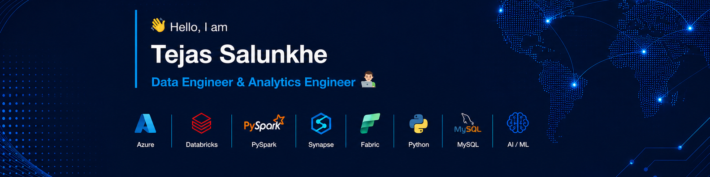

# Hi, I'm Tejas 👋

 

## About Me

I am a Data Science graduate with strong interests in **Data Engineering** and **Analytics Engineering**. I have built end-to-end data pipelines — ingesting data from Kaggle datasets, public APIs, and relational databases, transforming it using **Apache Spark** and **PySpark**, and implementing **Medallion Architecture** (Bronze, Silver, Gold layers) to deliver clean, analytics-ready outputs across modern cloud platforms.

I also actively develop and deploy **Machine Learning** and **Deep Learning** projects — including a live pneumonia detection application built using CNNs and deployed on Hugging Face Spaces.

I hold the **Microsoft Certified: Azure Data Fundamentals (DP-900)** certification and am currently preparing for **DP-600 — Fabric Analytics Engineer Associate**.

I am actively seeking opportunities in Data Engineering or Analytics Engineering. If you are working on impactful data or AI projects, feel free to connect.

 

## Connect with Me

  
  
  
  

 

## Certifications

> Currently preparing for **DP-600 — Microsoft Certified: Fabric Analytics Engineer Associate**

 

<!--## GitHub Stats

<!--  -->
<!--  -->
<!--  -->

  

